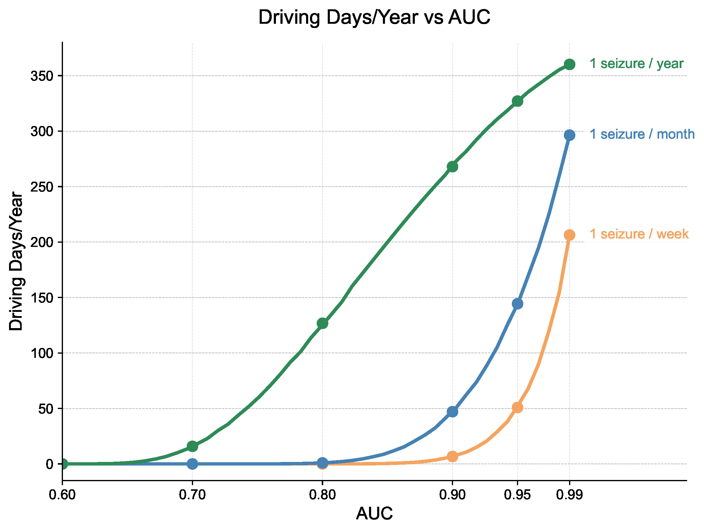
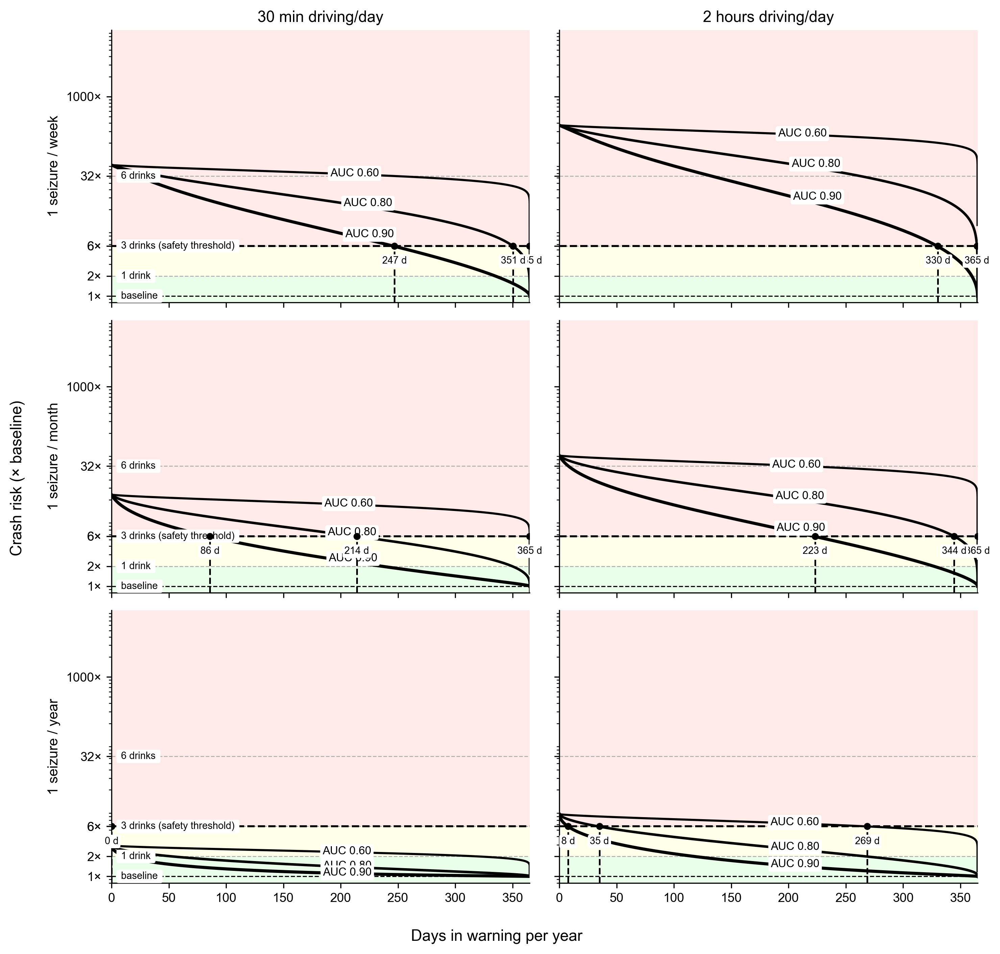
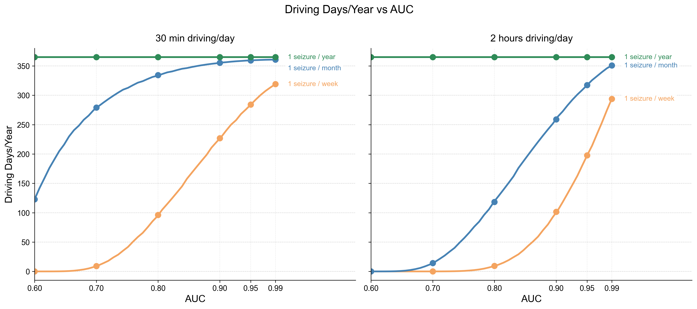
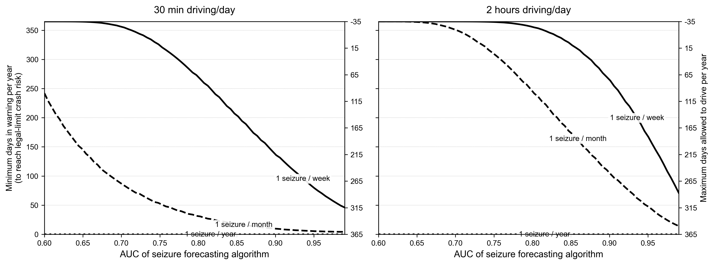
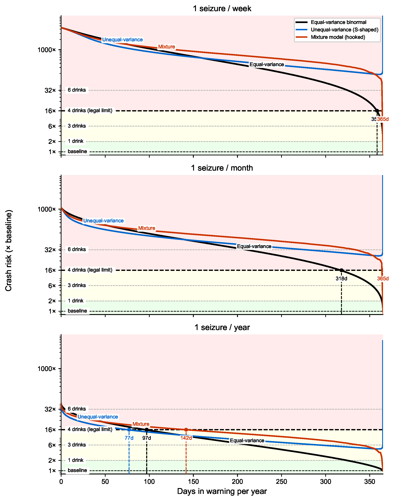
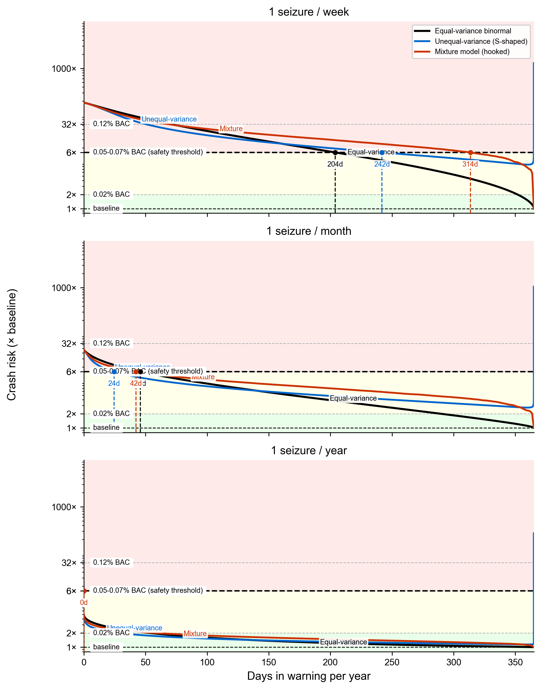
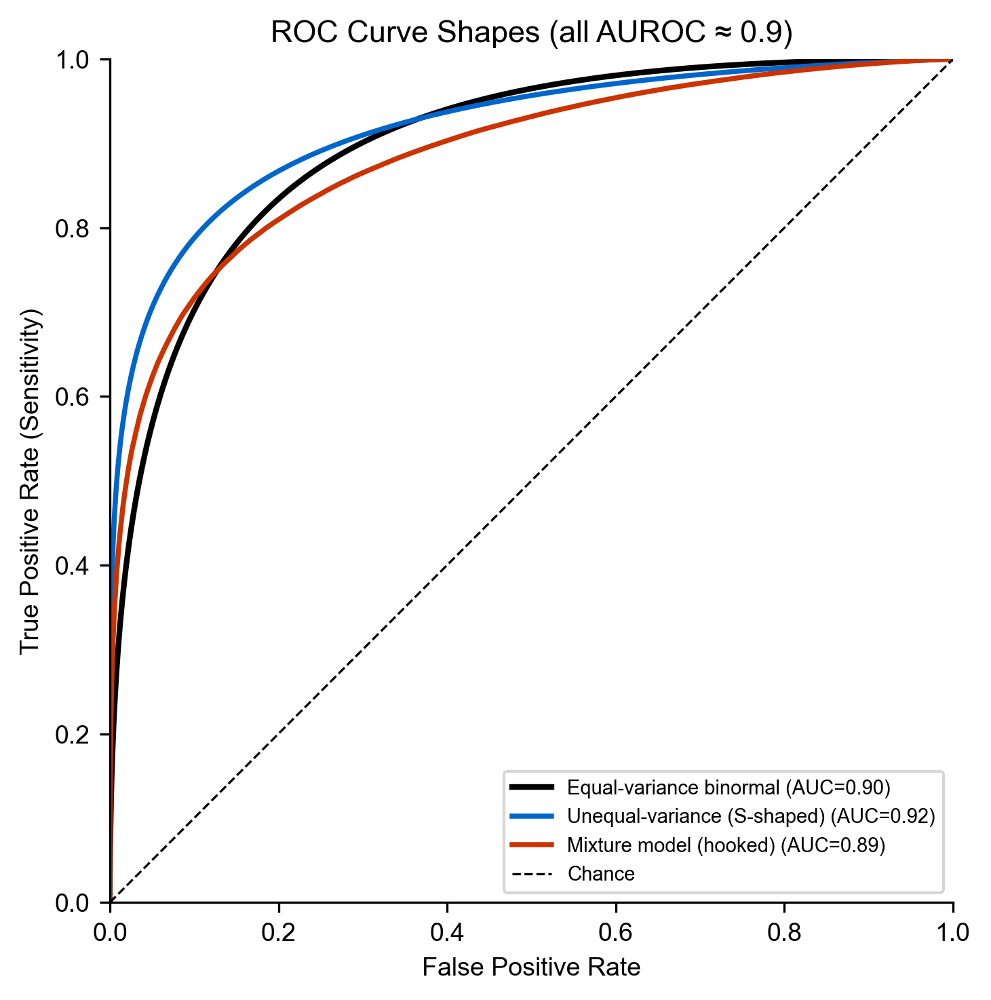

# Seizure Forecasting and Crash Risk Analysis

**Supplementary Materials for JAMA Neurology Paper**

This repository contains the complete analysis code, mathematical methods, and supplementary materials examining the relationship between seizure forecasting algorithm performance and driving safety.

---

## Table of Contents

### 1. [Overview](#1-overview)
### 2. [Repository Contents](#2-repository-contents)
### 3. [Key Results](#3-key-results)
   - 3.1 [Main Findings Table](#31-main-findings-table)
   - 3.2 [ROC Shape Sensitivity Analysis](#32-roc-shape-sensitivity-analysis)
### 4. [Figures](#4-figures)
   - 4.1 [Figure 1: Driving Days vs. AUC (Main)](#41-figure-1-driving-days-per-year-vs-auc-main-text)
   - 4.2 [Figure S1: Crash Risk vs. Days in Warning](#42-figure-s1-crash-risk-vs-days-in-warning-per-year)
   - 4.3 [Figure S2: Driving Days vs. AUC (Two Durations)](#43-figure-s2-driving-days-per-year-vs-auc-supplementary-two-driving-durations)
   - 4.4 [Figure S3: Minimum Warning Days vs. AUC](#44-figure-s3-minimum-warning-days-required-for-legal-limit-safety)
   - 4.5 [Figure S4: Binormal Forecast Model](#45-figure-s4-binormal-forecast-model-schematic)
   - 4.6 [Figure S5: ROC Shape Sensitivity](#46-figure-s5-sensitivity-to-roc-curve-shape)
   - 4.7 [Figure S6: ROC Curve Comparison](#47-figure-s6-comparison-of-roc-geometries)
### 5. [Mathematical Methods](#5-mathematical-methods)
   - 5.1 [Binormal ROC Model](#51-binormal-roc-model)
   - 5.2 [Sensitivity and False Positive Rate](#52-sensitivity-and-false-positive-rate)
   - 5.3 [Daily Seizure Probability](#53-daily-seizure-probability)
   - 5.4 [Posterior Probability (Bayes' Rule)](#54-posterior-probability-of-seizure-on-safe-days)
   - 5.5 [Crash Risk Calculation](#55-crash-risk-on-safe-days)
   - 5.6 [Time in Warning](#56-time-in-warning)
   - 5.7 [Legal-Limit Safety Threshold](#57-minimum-warning-days-for-legal-limit-safety)
   - 5.8 [AUC Performance Curves](#58-minimum-warning-days-vs-auc-figure-s1)
   - 5.9 [Reproducibility](#59-reproducibility)
   - 5.10 [ROC Shape Analysis](#510-why-roc-shape-matters-and-why-it-doesnt)
   - 5.11 [Alternative ROC Models](#511-alternative-roc-models-tested)
   - 5.12 [Mathematical Formulations](#512-mathematical-formulations-of-alternative-roc-shapes)
   - 5.13 [Impact on Conclusions](#513-impact-on-driving-safety-conclusions)
### 6. [Discussion: Validity of Binormal Assumption](#6-discussion-validity-of-the-binormal-roc-assumption)
### 7. [Running the Code](#7-running-the-code)
### 8. [Citation & Contact](#8-citation-and-contact)

---

## 1. Overview

This analysis quantifies the trade-offs between seizure forecasting accuracy (measured by AUC), driving exposure, and driving restrictions required to maintain crash risk at or below legal intoxication levels (approximately 16× baseline risk).

**Key modeling feature:** We explicitly model the probability that a seizure occurs *during* driving as a function of daily driving duration. For someone driving 30 minutes per day, the probability that a seizure coincides with driving is 0.5/24 ≈ 2.1%; for 1 hour per day, 1/24 ≈ 4.2%; for 2 hours of daily driving, this increases to 2/24 ≈ 8.3%. This recognizes that seizures occurring outside of driving hours pose minimal crash risk. We use 1 hour/day as the primary scenario in our main text figure, as this represents a typical driving duration for American drivers.[1,2]

**Key findings:** Patients with infrequent seizures (≤1 per year) are already below the legal-limit crash risk threshold even without forecasting, particularly with limited daily driving. For patients with frequent seizures, forecasting can enable meaningful driving privileges, though substantial restrictions remain necessary even with high-performance algorithms (AUC ≥ 0.90).

---

## 2. Repository Contents

### Code
- **[`crashes_vs_TiW.ipynb`](crashes_vs_TiW.ipynb)** - Complete Jupyter notebook with all analysis code
  - Cell 0: Figure S1 (crash risk vs. warning days, 3×2 grid by seizure frequency and driving duration)
  - Cell 1: Figure 1 (driving days vs. AUC) for main text - single-panel plot with 1 hour/day driving
  - Cell 2: Figure S2 (driving days vs. AUC, supplementary) - 2-panel plot for 30 min and 2 hr driving
  - Cell 3: Figure S3 (minimum warning days vs. AUC) - 2-panel plot
  - Cell 4: Figure S4 (binormal model schematic)
  - Cell 5: ROC shape sensitivity analysis (Figures S5 and S6) - uses 1 hour/day driving
  - Cell 6: Markdown cell for extended AUC table introduction
  - Cell 7: Extended AUC table code - comprehensive table with AUC values 0.60-0.99

### Figures (PDF and PNG formats)
- **`Figure_1`** - Driving days/year vs. AUC (main text figure, 1 hour/day)
- **`Figure_S1`** - Crash risk vs. warning days (supplementary, 3×2 grid)
- **`Figure_S2`** - Driving days/year vs. AUC (supplementary, 2-panel: 30 min and 2 hr/day)
- **`Figure_S3`** - Minimum warning days vs. AUC (supplementary, 2-panel)
- **`Figure_S4`** - Binormal forecast model schematic (supplementary)
- **`Figure_S5`** - ROC shape sensitivity analysis (supplementary)
- **`Figure_S6`** - ROC curve geometries comparison (supplementary)

*PNG versions are displayed in this README; PDF versions are provided for publication.*

---

## 3. Key Results

### 3.1 Main Findings Table

**Driving Restrictions Required to Achieve Legal-Limit Crash Risk by Seizure Frequency, Driving Duration, and Forecasting Performance**

At the legal-limit safety threshold (16× baseline crash risk, equivalent to BAC ≈ 0.08%):

#### 30 Minutes Driving per Day

| Seizure Frequency | AUC | Warning Days/Year | Driving Days/Year | Avg Days Between Drives |
|------------------|-----|-------------------|-------------------|------------------------|
| **1/week** | 0.60 | 365 | 0 | Cannot reach safety threshold |
| | 0.80 | 269 | 96 | 3.8 |
| | 0.90 | 138 | 227 | 1.6 |
| **1/month** | 0.60 | 242 | 123 | 3.0 |
| | 0.80 | 31 | 334 | 1.1 |
| | 0.90 | 10 | 355 | 1.0 |
| **1/year** | 0.60 | 0 | 365 | 1.0 (already safe) |
| | 0.80 | 0 | 365 | 1.0 (already safe) |
| | 0.90 | 0 | 365 | 1.0 (already safe) |

#### 2 Hours Driving per Day

| Seizure Frequency | AUC | Warning Days/Year | Driving Days/Year | Avg Days Between Drives |
|------------------|-----|-------------------|-------------------|------------------------|
| **1/week** | 0.60 | 365 | 0 | Cannot reach safety threshold |
| | 0.80 | 356 | 9 | 39.2 |
| | 0.90 | 264 | 102 | 3.6 |
| **1/month** | 0.60 | 365 | 0 | Cannot reach safety threshold |
| | 0.80 | 247 | 118 | 3.1 |
| | 0.90 | 106 | 259 | 1.4 |
| **1/year** | 0.60 | 0 | 365 | 1.0 (already safe) |
| | 0.80 | 0 | 365 | 1.0 (already safe) |
| | 0.90 | 0 | 365 | 1.0 (already safe) |

**Key Insights:**

- **Driving duration matters substantially:** For weekly seizures with AUC = 0.90, a 30-min/day driver gets 227 driving days/year vs. only 102 days for a 2-hr/day driver
- **Patients with rare seizures (≤1/year) are already safe** under this model regardless of AUC, because the joint probability of (seizure today) × (seizure occurs while driving) × (crash given seizure) is extremely low
- **Monthly seizure patients benefit greatly from forecasting:** With 30 min/day driving and AUC = 0.80, they can drive 334 days/year (vs. essentially none under naive models)
- **Weekly seizure patients still face significant restrictions** but can achieve meaningful driving with high-AUC forecasting

### 3.2 ROC Shape Sensitivity Analysis

**Note:** This sensitivity analysis uses 1 hour of driving per day (intermediate between the 30 min and 2 hour scenarios in the main analysis).

Comparison of driving days allowed per year across different ROC shapes (all AUC ≈ 0.90):

| Seizure Frequency | Equal-variance binormal | S-shaped (unequal variance) | Hooked (mixture) |
|------------------|------------------------|----------------------------|------------------|
| **1/week** | 7 days | Cannot reach safety | 0 days |
| **1/month** | 47 days | Cannot reach safety | 0 days |
| **1/year** | 268 days | **288 days** | 223 days |

**Key Observations:**
1. **High seizure frequencies:** ROC shape doesn't matter—all models struggle
2. **Low seizure frequency:** S-shaped ROC can outperform (288 vs 268 days/year)
3. **Overall:** Limited AUC, not ROC geometry, is the fundamental barrier

---

## 4. Figures

### 4.1 Figure 1: Driving Days per Year vs. AUC (Main Text)



**Description:** Annual driving days permitted under forecasting-based driving policy to maintain crash risk below legal intoxication threshold (16× baseline), assuming 1 hour of driving per day.

**Key features:**
- **Three colored curves:** Show relationship between AUC and safe driving days for different seizure frequencies
  - Green: 1 seizure/year
  - Blue: 1 seizure/month
  - Orange: 1 seizure/week
- **Filled circles:** Mark key AUC values (0.60, 0.70, 0.80, 0.90, 0.95, 0.99)
- **Smooth curves:** Calculated analytically using equal-variance binormal ROC model with Bayes' theorem
- **Inline labels:** Tufte-style data-integrated labels placed directly on curves

**Key finding:** Even high-performance algorithms (AUC = 0.90) require substantial driving restrictions for patients with frequent seizures. With 1 hour/day driving at AUC 0.90: weekly seizures permit ~160 days/year, monthly seizures permit ~310 days/year, and yearly seizures permit 365 days/year (already safe).

---

### 4.2 Figure S1: Crash Risk vs. Days in Warning per Year



**Description:** Crash risk when driving after a negative seizure forecast, as a function of time in warning. The figure displays a 3×2 grid: rows correspond to seizure frequencies (1/week, 1/month, 1/year) and columns correspond to daily driving duration (30 min/day, 2 hr/day).

**Key features:**
- **Black curves:** Algorithms with AUROC = 0.60, 0.80, and 0.90 (thicker lines = higher AUC)
- **X-axis:** Days per year the algorithm advises against driving ("time in warning")
- **Y-axis:** Crash risk as a multiple of baseline sober driving risk
- **Horizontal dashed lines:** Crash risks equivalent to driving after 1, 3, 4 (legal limit at 0.08% BAC), and 6 alcoholic drinks
- **Black circles:** Minimum warning time required to achieve the legal-limit threshold (~16× baseline)
- **Light green region:** "Safe" zone (below 1-drink equivalent)
- **Light yellow region:** "Caution" zone (1-4 drinks equivalent)
- **Light pink region:** "Unsafe" zone (above legal limit)

**Updated crash model:** We compute crash risk accounting for the probability that a seizure occurs *during* driving:

$$P(\text{crash} | \text{seizure day}) = P(\text{driving at seizure time}) \times P(\text{crash} | \text{seizure while driving}) + P(\text{not driving at seizure time}) \times p_0$$

Where:
- $P(\text{driving at seizure time}) = \frac{\text{driving hours}}{24}$ (assuming seizure timing is uniformly distributed)
- $P(\text{crash} | \text{seizure while driving}) = 0.5$
- $p_0 = 1.5 \times 10^{-5}$ (baseline crash risk per trip)

**Key observations:**
- **Patients with yearly seizures** are already below the legal-limit threshold even without forecasting, regardless of driving duration
- **Driving duration has a major impact:** Compare left column (30 min/day) to right column (2 hr/day)—the curves shift substantially, reflecting the 4× difference in seizure-during-driving probability
- **Monthly seizure patients** can achieve safe driving with modest forecasting performance (AUC ≥ 0.60 for light drivers)

---

### 4.3 Figure S2: Driving Days per Year vs. AUC (Supplementary, Two Driving Durations)



**Description:** Two-panel figure showing annual driving days permitted under forecasting-based driving policy to maintain crash risk below legal intoxication threshold (16× baseline). Left panel: 30 minutes driving/day. Right panel: 2 hours driving/day.

**Key features:**
- **Three colored curves** (per panel): Show relationship between AUC and safe driving days for different seizure frequencies
  - Green: 1 seizure/year
  - Blue: 1 seizure/month
  - Orange: 1 seizure/week
- **Filled circles:** Mark key AUC values (0.60, 0.70, 0.80, 0.90, 0.95, 0.99)
- **Inline labels:** Tufte-style data-integrated labels placed directly on curves

**Key finding:** Driving exposure matters substantially. For weekly seizures with AUC = 0.90, a 30-min/day driver gets 227 driving days/year vs. only 102 days for a 2-hr/day driver—demonstrating the critical impact of the probability that a seizure occurs during driving hours.

---

### 4.4 Figure S3: Minimum Warning Days Required for Legal-Limit Safety



**Description:** Two-panel figure showing how minimum warning days required to achieve legal-limit safety varies with AUC for each seizure frequency. Left panel: 30 minutes driving/day. Right panel: 2 hours driving/day. The secondary y-axis shows the corresponding maximum driving days allowed per year (365 minus warning days).

---

### 4.5 Figure S4: Binormal Forecast Model Schematic



**Description:** Illustrates the statistical model underlying the primary analysis.

**Model components:**
- Forecast scores on non-seizure days: N(0,1)
- Forecast scores on seizure days: N(m,1)
- Threshold *t* defines the operating point
- Bayes' theorem combines sensitivity, specificity, and base rate to compute posterior seizure risk

This schematic shows how the forecasting algorithm separates seizure from non-seizure days and how Bayes' rule computes crash risk on "safe" days.

---

### 4.6 Figure S5: Sensitivity to ROC Curve Shape



**Description:** Compares crash risk vs. warning days for different ROC curve shapes (equal-variance binormal, S-shaped/unequal variance, hooked/mixture model) at fixed AUC ≈ 0.90. This analysis uses 1 hour of driving per day (same as the main text figure). The figure shows three panels (one per seizure frequency) with colored curves for each ROC shape.

---

### 4.7 Figure S6: Comparison of ROC Geometries



**Description:** Visualizes the three ROC curve shapes tested in the sensitivity analysis.

---

## 5. Mathematical Methods

### 5.1 Binormal ROC Model

We model the forecasting algorithm output as normally distributed scores. For a threshold $t$:

- Non-seizure days: $S \sim N(0, 1)$
- Seizure days: $S \sim N(m, 1)$

The separation parameter $m$ is related to AUC by:

$$m = \sqrt{2} \cdot \Phi^{-1}(\text{AUC})$$

---

### 5.2 Sensitivity and False Positive Rate

For threshold $t$:

$$\text{Sensitivity} = P(S > t | \text{seizure}) = 1 - \Phi(t - m) = \Phi(m - t)$$

$$\text{FPR} = P(S > t | \text{no seizure}) = 1 - \Phi(t)$$

---

### 5.3 Daily Seizure Probability

For a patient with average seizure rate $R$ (seizures per day), the daily seizure probability under a Poisson process is:

$$p = 1 - e^{-R}$$

For example:
- 1 seizure/week: $R = 1/7$, $p \approx 0.133$
- 1 seizure/month: $R = 1/30$, $p \approx 0.033$
- 1 seizure/year: $R = 1/365$, $p \approx 0.0027$

---

### 5.4 Posterior Probability of Seizure on "Safe" Days

Using Bayes' theorem, the probability of a seizure given a negative forecast ("safe" day):

$$P(\text{seizure} | \text{safe}) = \frac{P(\text{safe} | \text{seizure}) \cdot p}{P(\text{safe} | \text{seizure}) \cdot p + P(\text{safe} | \text{no seizure}) \cdot (1-p)}$$

$$= \frac{(1 - \text{Sensitivity}) \cdot p}{(1 - \text{Sensitivity}) \cdot p + (1 - \text{FPR}) \cdot (1-p)}$$

$$= \frac{\Phi(t - m) \cdot p}{\Phi(t - m) \cdot p + \Phi(t) \cdot (1-p)}$$

---

### 5.5 Crash Risk on "Safe" Days

**Updated model accounting for driving exposure:**

The probability of a crash on a "safe" day depends on whether a seizure occurs and, if so, whether the person is driving at that moment:

$$P(\text{crash} | \text{safe day}) = P(\text{seizure} | \text{safe}) \cdot P(\text{crash} | \text{seizure day}) + P(\text{no seizure} | \text{safe}) \cdot p_0$$

Where the crash probability given a seizure day accounts for driving exposure:

$$P(\text{crash} | \text{seizure day}) = P(\text{driving at seizure time}) \cdot P(\text{crash} | \text{seizure while driving}) + P(\text{not driving at seizure time}) \cdot p_0$$

**Key parameters:**
- $P(\text{driving at seizure time}) = \frac{D}{24}$, where $D$ is hours of driving per day
- $P(\text{crash} | \text{seizure while driving}) = 0.5$ (assumed)
- $p_0 = 1.5 \times 10^{-5}$ (baseline crash risk per trip)

**For 30 minutes driving/day:**
$$P(\text{driving at seizure time}) = \frac{0.5}{24} \approx 0.021$$

**For 2 hours driving/day:**
$$P(\text{driving at seizure time}) = \frac{2}{24} \approx 0.083$$

This formulation recognizes that even if a seizure occurs on a given day, it only poses a driving risk if it happens to occur during the limited time window when the person is actually driving.

**Relative crash risk:**

$$\text{Relative risk} = \frac{P(\text{crash} | \text{safe day})}{p_0}$$

---

### 5.6 Time in Warning

The proportion of days spent in warning (forecast positive):

$$P(\text{warning}) = \text{Sensitivity} \cdot p + \text{FPR} \cdot (1-p)$$

$$\text{Days in warning per year} = P(\text{warning}) \times 365$$

---

### 5.7 Minimum Warning Days for Legal-Limit Safety

The legal limit for driving (BAC ≈ 0.08%) corresponds to approximately 16× baseline crash risk. We find the operating threshold $t$ such that:

$$\frac{P(\text{crash} | \text{safe day})}{p_0} \leq 16$$

The corresponding days in warning gives the minimum restriction required for legal-limit safety.

---

### 5.8 Minimum Warning Days vs. AUC (Figure S3)

For each AUC, we compute the minimum warning days required to achieve the legal-limit safety threshold by:

1. Computing $m = \sqrt{2} \cdot \Phi^{-1}(\text{AUC})$
2. Sweeping threshold $t$ to find operating points
3. Identifying the threshold where crash risk equals 16× baseline
4. Computing the corresponding days in warning

---

### 5.9 Reproducibility

All calculations use:
- NumPy for numerical operations
- SciPy's `norm` for Gaussian CDF/inverse CDF
- Matplotlib for visualization
- Analytical (closed-form) expressions—no Monte Carlo simulation required

---

### 5.10 Why ROC Shape Matters (and Why It Doesn't)

The binormal ROC assumption implies a specific relationship between sensitivity and specificity. Real-world ROC curves can deviate due to:

- **Unequal variances**: S-shaped ROC curves
- **Mixture distributions**: Hooked ROC curves (some seizures easier to predict than others)
- **Finite samples**: Stepwise empirical ROC curves

Our sensitivity analysis (Section 3.2) tests whether these deviations affect conclusions.

---

### 5.11 Alternative ROC Models Tested

We compare three score-generating models, all calibrated to AUC ≈ 0.90:

**1. Equal-variance binormal** (baseline):
- Negatives: $N(0, 1)$
- Positives: $N(m, 1)$ where $m = \sqrt{2} \cdot \Phi^{-1}(0.90) \approx 1.81$

**2. Unequal-variance binormal** (S-shaped):
- Negatives: $N(0, 1)$
- Positives: $N(2.4, 1.4)$
- Larger variance in positives creates S-shaped ROC

**3. Mixture model** (hooked):
- Negatives: $N(0, 1)$
- Positives: $0.7 \cdot N(2.5, 1) + 0.3 \cdot N(0.8, 1)$
- Mixture creates "hooked" ROC that rises quickly then flattens

---

### 5.12 Mathematical Formulations of Alternative ROC Shapes

#### Unequal-Variance Binormal Model

For threshold $t$:

$$\text{Sensitivity} = 1 - \Phi\left(\frac{t - \mu_1}{\sigma_1}\right)$$

$$\text{FPR} = 1 - \Phi(t)$$

Where $\mu_1 = 2.4$ and $\sigma_1 = 1.4$ are chosen to achieve AUC ≈ 0.90.

Posterior probability of seizure on a "safe" day:

$$P(\text{seizure} | \text{safe}) = \frac{\Phi\left(\frac{t - \mu_1}{\sigma_1}\right) \cdot p}{\Phi\left(\frac{t - \mu_1}{\sigma_1}\right) \cdot p + \Phi(t)(1-p)}$$

#### Mixture Model

For a mixture of two Gaussians in the positive class, with mixing weight $w$:

$$\text{Sensitivity} = w \cdot \left[1 - \Phi(t - \mu_{\text{easy}})\right] + (1-w) \cdot \left[1 - \Phi(t - \mu_{\text{hard}})\right]$$

Where $w = 0.7$, $\mu_{\text{easy}} = 2.5$, and $\mu_{\text{hard}} = 0.8$.

Probability of being below threshold for the positive class:

$$P(S < t | \text{seizure}) = w \cdot \Phi(t - \mu_{\text{easy}}) + (1-w) \cdot \Phi(t - \mu_{\text{hard}})$$

---

### 5.13 Impact on Driving Safety Conclusions

The ROC shape sensitivity analysis reveals nuanced but important findings:

**At high seizure frequencies (weekly or monthly):**
- All ROC shapes struggle to achieve safe driving
- Mixture model is most conservative (fewest allowed driving days)
- S-shaped ROC often cannot reach the safety threshold at all
- **Conclusion:** Limited discriminative ability, not ROC shape, is the barrier

**At low seizure frequency (yearly):**
- ROC shape has more substantial impact
- S-shaped ROC can outperform equal-variance binormal (288 vs 268 days/year)
- Mixture model is more conservative (223 days/year)
- **Conclusion:** At low frequencies and high AUC, shape affects *how many* driving days, but all models permit substantial driving

**Overall interpretation:**
- Using the equal-variance binormal model is reasonable and standard
- It tends to give the forecasting algorithm the "benefit of the doubt"
- Main conclusions about difficulty of safe forecasting-based driving policies are **robust to ROC shape assumptions**
- For safety-critical applications, **overall discriminative ability (AUC) matters far more than fine-grained ROC geometry**

---

## 6. Discussion: Validity of the Binormal ROC Assumption

### Is the binormal model a reasonable simplification?

**Yes, for several reasons:**

1. **Standard statistical approximation**: Widely used in biomedical research, diagnostic testing, and signal detection theory

2. **Mathematically tractable**: Closed-form expressions enable transparent, reproducible analysis without simulation

3. **Generally optimistic**: For a given AUC, equal-variance binormal ROC tends to offer near-best-case sensitivity-specificity trade-offs

4. **Appropriate for conceptual analysis**: Our paper addresses "what level of performance (AUC) is needed for safe driving decisions?"—not "how does this specific empirical ROC curve perform?"

### What about real-world ROC curves that aren't binormal?

Empirical ROC curves can indeed deviate from binormal shape due to:
- Unequal variances between seizure and non-seizure score distributions
- Mixture distributions (subpopulations of easy vs. hard-to-predict seizures)
- Nonlinearities in underlying physiological signals
- Finite-sample effects

**However, our sensitivity analysis shows these deviations do not undermine the main conclusions:**

- At **high seizure frequencies** (weekly/monthly), all ROC shapes—including those more optimistic than binormal—fail to support frequent safe driving even at AUC = 0.90
- At **low seizure frequency** (yearly), all ROC shapes with AUC = 0.90 permit substantial driving, though exact days vary by shape
- The fundamental barrier is **limited discriminative ability (AUC)**, not detailed ROC geometry

### Validity of the driving exposure model

The updated model assumes:

1. **Seizure timing is uniformly distributed** throughout the day. This is a simplification—many patients have circadian seizure patterns (e.g., nocturnal epilepsy, morning clustering). For patients with seizures concentrated outside typical driving hours, the model may be conservative; for those with daytime clustering, it may be optimistic.

2. **Driving duration is constant across days**. In reality, driving varies day-to-day. The 30 min/day and 2 hr/day scenarios bracket typical commuter and heavy driver patterns.

3. **P(crash | seizure while driving) = 50%**. This is a conservative assumption based on limited empirical data. The actual probability depends on seizure type, warning symptoms (aura), road conditions, and vehicle safety features.

### Recommendations for algorithm developers

If you are developing a seizure forecasting algorithm:

1. **Aim for AUC ≥ 0.90** as a minimum for driving applications
2. **Characterize your empirical ROC shape**—if it's S-shaped or hooked, this may affect optimal operating points
3. **For patients with frequent seizures**, even AUC = 0.90 may be insufficient for safe, practical driving policies
4. **For patients with rare seizures**, forecasting may be unnecessary for safety—focus on other quality-of-life benefits
5. **Consider patient-specific driving patterns** when counseling about risk

---

## 7. Running the Code

### Requirements

```bash
pip install numpy matplotlib scipy
```

### Execution

Open and run the Jupyter notebook:

```bash
jupyter notebook crashes_vs_TiW.ipynb
```

Or run all cells programmatically:

```bash
jupyter nbconvert --to notebook --execute crashes_vs_TiW.ipynb
```

### Outputs

The notebook generates:
- **Six PDF figures** (high-resolution for publication)
- **Six PNG figures** (for display on GitHub)
- **Comprehensive table** (tab-delimited, ready for Word)
- **Detailed statistics** for all AUC values, seizure frequencies, and driving durations

**Figure files:**
- `Figure_1.pdf/png` - Main text figure (driving days vs. AUC, 1 hour/day)
- `Figure_S1.pdf/png` - Supplementary figure (crash risk vs. warning days, 3×2 grid)
- `Figure_S2.pdf/png` - Supplementary figure (driving days vs. AUC, 2-panel: 30 min and 2 hr/day)
- `Figure_S3.pdf/png` - Supplementary figure (minimum warning days vs. AUC, 2-panel)
- `Figure_S4.pdf/png` - Supplementary figure (binormal model schematic)
- `Figure_S5.pdf/png` - Supplementary figure (ROC shape sensitivity)
- `Figure_S6.pdf/png` - Supplementary figure (ROC curve geometries)

---

## 8. Citation and Contact

### Citation

[Citation information will be added upon publication]

### References

1. AAA Foundation for Traffic Safety. (2024). *American Driving Survey, 2023*. Retrieved from https://aaafoundation.org/wp-content/uploads/2024/08/202408-AAAFTS-American-Driving-Survey-2023.pdf

2. U.S. Census Bureau. (2024). *Commuting Characteristics by Sex: 2023* (ACSBR-018). Retrieved from https://www2.census.gov/library/publications/2024/demo/acsbr-018.pdf

### License

See [LICENSE](LICENSE) file for details.

---

*Last updated: December 7, 2024*
