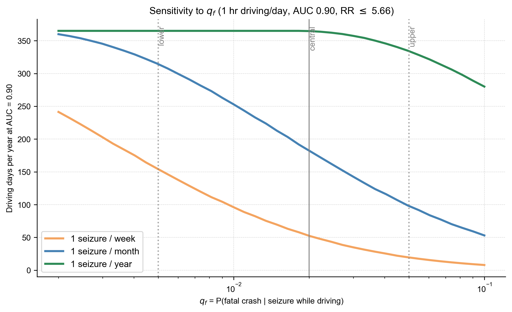
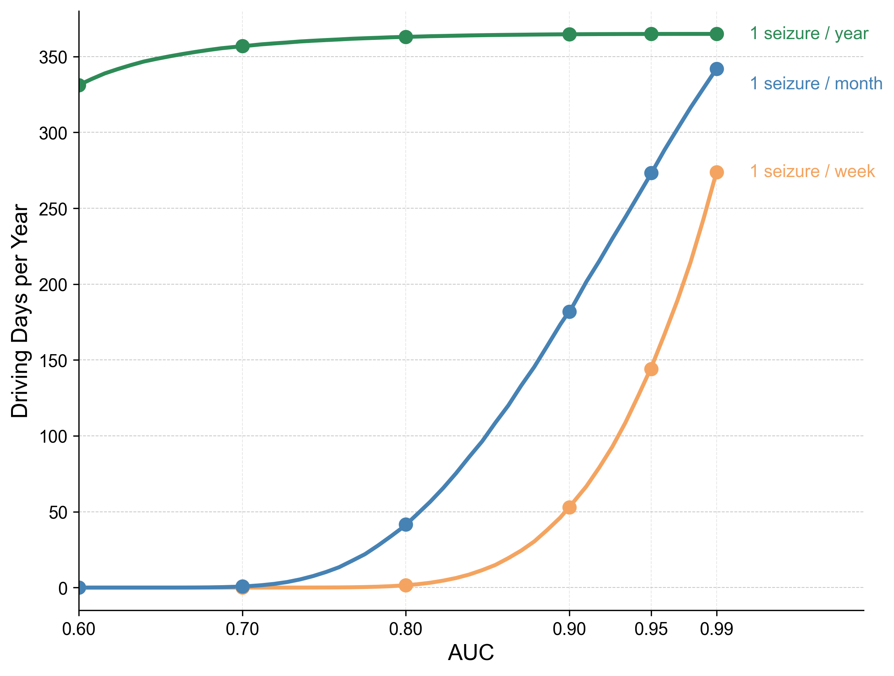
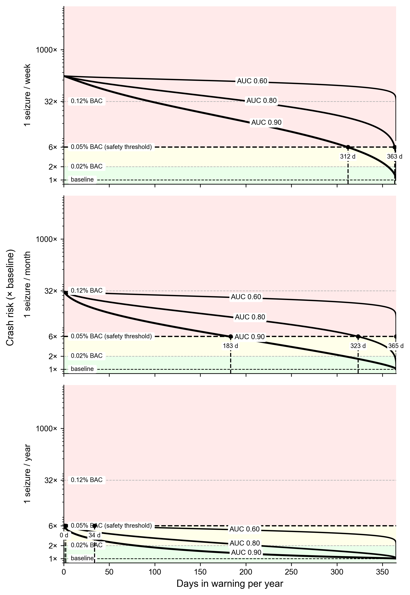
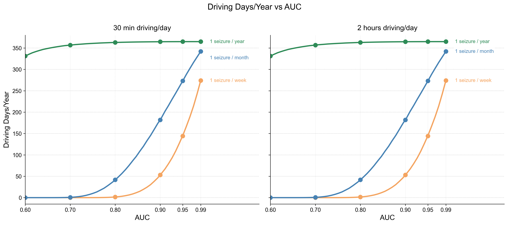
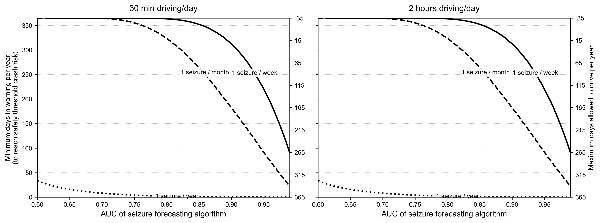
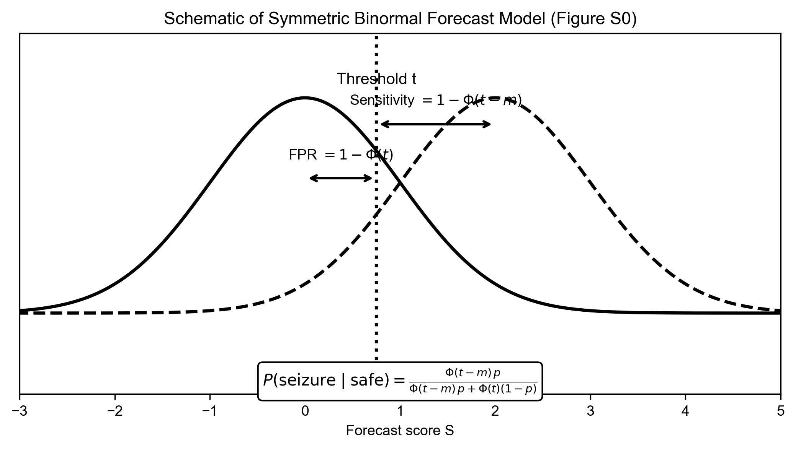
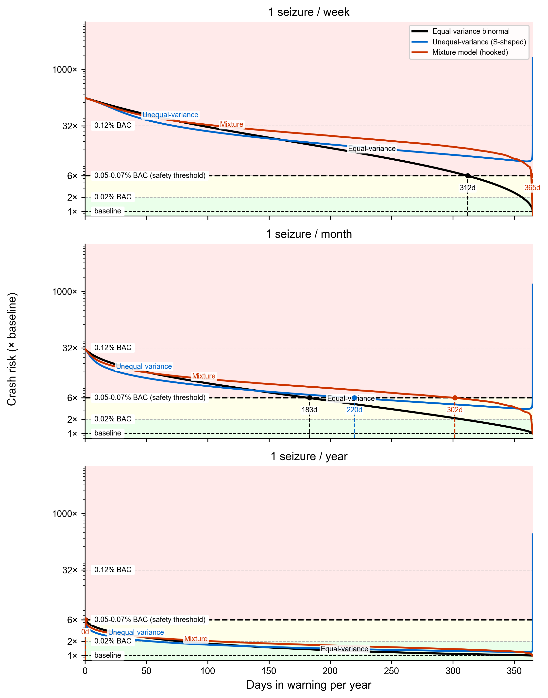
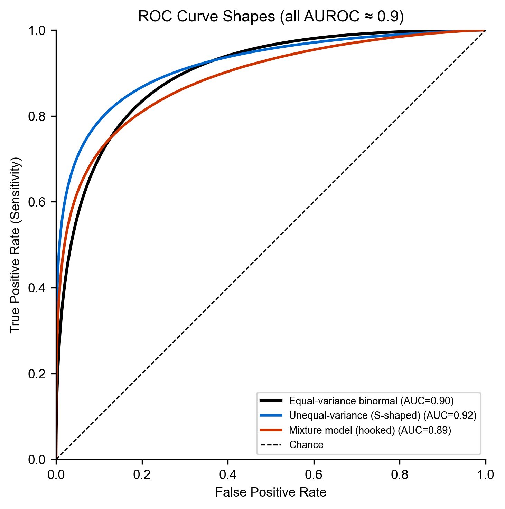

# Seizure Forecasting and Crash Risk Analysis

**Supplementary Materials for JAMA Neurology Paper**

This repository contains the complete analysis code, mathematical methods, and supplementary materials examining the relationship between seizure forecasting algorithm performance and driving safety.

---

## Table of Contents

### 1. [Overview](#1-overview)
### 2. [Repository Contents](#2-repository-contents)
### 3. [Key Results](#3-key-results)
   - 3.1 [Main Findings Table](#31-main-findings-table)
   - 3.2 [ROC Shape Sensitivity Analysis](#32-roc-shape-sensitivity-analysis)
   - 3.3 [Sensitivity to $q_f$ (P(fatal crash | seizure while driving))](#33-sensitivity-to-q_f)
### 4. [Figures](#4-figures)
   - 4.1 [Figure 1: Driving Days vs. AUC (Main)](#41-figure-1-driving-days-per-year-vs-auc-main-text)
   - 4.2 [Figure S1: Crash Risk vs. Days in Warning](#42-figure-s1-crash-risk-vs-days-in-warning-per-year)
   - 4.3 [Figure S2: Driving Days vs. AUC (Two Durations)](#43-figure-s2-driving-days-per-year-vs-auc-supplementary-two-driving-durations)
   - 4.4 [Figure S3: Minimum Warning Days vs. AUC](#44-figure-s3-minimum-warning-days-required-for-legal-limit-safety)
   - 4.5 [Figure S4: Binormal Forecast Model](#45-figure-s4-binormal-forecast-model-schematic)
   - 4.6 [Figure S5: ROC Shape Sensitivity](#46-figure-s5-sensitivity-to-roc-curve-shape)
   - 4.7 [Figure S6: ROC Curve Comparison](#47-figure-s6-comparison-of-roc-geometries)
### 5. [Mathematical Methods](#5-mathematical-methods)
   - 5.1 [Binormal ROC Model](#51-binormal-roc-model)
   - 5.2 [Sensitivity and False Positive Rate](#52-sensitivity-and-false-positive-rate)
   - 5.3 [Daily Seizure Probability](#53-daily-seizure-probability)
   - 5.4 [Posterior Probability (Bayes' Rule)](#54-posterior-probability-of-seizure-on-safe-days)
   - 5.5 [Crash Risk Calculation](#55-crash-risk-on-safe-days)
   - 5.6 [Time in Warning](#56-time-in-warning)
   - 5.7 [Minimum Warning Days for Safety Threshold](#57-minimum-warning-days-for-safety-threshold)
   - 5.8 [Minimum Warning Days vs. AUC](#58-minimum-warning-days-vs-auc-figure-s3)
   - 5.9 [Reproducibility](#59-reproducibility)
   - 5.10 [Why ROC Shape Matters (and Why It Doesn't)](#510-why-roc-shape-matters-and-why-it-doesnt)
   - 5.11 [Alternative ROC Models](#511-alternative-roc-models-tested)
   - 5.12 [Mathematical Formulations](#512-mathematical-formulations-of-alternative-roc-shapes)
   - 5.13 [Impact on Conclusions](#513-impact-on-driving-safety-conclusions)
### 6. [Discussion: Validity of Binormal Assumption](#6-discussion-validity-of-the-binormal-roc-assumption)
### 7. [Running the Code](#7-running-the-code)
### 8. [Citation & Contact](#8-citation-and-contact)

---

## 1. Overview

This analysis quantifies the trade-offs between seizure forecasting accuracy (measured by AUC), driving exposure, and driving restrictions required to maintain fatal crash risk at or below a safety threshold of 6× baseline, corresponding to BAC ≈0.06–0.07% for adult drivers. This benchmark is aligned with the 0.05% BAC standard used in Utah and most European countries, and is more conservative than the 0.08% BAC legal limit used in 49 U.S. states. This benchmark refers specifically to relative risk of fatal single-vehicle crashes (not legal permissibility) and reflects the principle that AI-assisted medical decisions should meet substantially higher safety standards than merely matching known dangerous activities.

**Key modeling feature.** We model relative fatal crash risk on forecasted "safe" days using a unit-consistent per-hour fatal-crash baseline ($\lambda_f \approx 4.5 \times 10^{-7}$/hr, derived from NHTSA Passenger Vehicles 2023 and FHWA Highway Statistics 2023) and a fatal-specific conditional probability $q_f = P(\text{fatal crash} \mid \text{seizure while driving}) = 0.02$ (central estimate; range 0.005–0.05 examined as sensitivity). The probability that a seizure coincides with driving still scales as $D/24$ for daily driving duration $D$, but because both numerator and denominator now scale with exposure, the relative-risk benchmark is approximately invariant to $D$ — only absolute risk scales. We use 1 hour/day as the primary scenario in our main text figure, as this represents a typical driving duration for American drivers.[1,2]

**Key findings:** With the 6× baseline fatal crash risk safety threshold and central $q_f = 0.02$, patients with infrequent seizures (≤1 per year) approach unrestricted driving even at low AUC. For patients with frequent seizures, high-performance forecasting algorithms (AUC ≥ 0.90) can enable meaningful driving privileges: weekly seizures permit ~53 days/year, monthly seizures permit ~182 days/year, and yearly seizures permit ~365 days/year. These results are largely insensitive to driving duration but moderately sensitive to $q_f$ (see Section 3.3).

---

## 2. Repository Contents

### Code
- **[`crashes_vs_TiW.ipynb`](crashes_vs_TiW.ipynb)** - Complete Jupyter notebook with all analysis code
  - Cell 0: Figure S1 (crash risk vs. warning days, 3×2 grid by seizure frequency and driving duration)
  - Cell 1: Figure 1 (driving days vs. AUC) for main text - single-panel plot with 1 hour/day driving
  - Cell 2: Figure S2 (driving days vs. AUC, supplementary) - 2-panel plot for 30 min and 2 hr driving
  - Cell 3: Figure S3 (minimum warning days vs. AUC) - 2-panel plot
  - Cell 4: Figure S4 (binormal model schematic)
  - Cell 5: ROC shape sensitivity analysis (Figures S5 and S6) - uses 1 hour/day driving
  - Cell 6: Markdown cell for extended AUC table introduction
  - Cell 7: Extended AUC table code - comprehensive table with AUC values 0.60-0.99

### Figures (PDF and PNG formats)
- **`Figure_1`** - Driving days/year vs. AUC (main text figure, 1 hour/day)
- **`Figure_S1`** - Crash risk vs. warning days (supplementary, 3×2 grid)
- **`Figure_S2`** - Driving days/year vs. AUC (supplementary, 2-panel: 30 min and 2 hr/day)
- **`Figure_S3`** - Minimum warning days vs. AUC (supplementary, 2-panel)
- **`Figure_S4`** - Binormal forecast model schematic (supplementary)
- **`Figure_S5`** - ROC shape sensitivity analysis (supplementary)
- **`Figure_S6`** - ROC curve geometries comparison (supplementary)

---

## 3. Key Results

### 3.1 Main Findings Table

**Driving Restrictions Required to Achieve Safety Threshold by Seizure Frequency and Forecasting Performance**

At the safety threshold (6× baseline fatal crash risk, corresponding to BAC ≈0.06–0.07%), with $q_f = 0.02$ and $\lambda_f = 4.5\times 10^{-7}$/hr:

| Seizure Frequency | AUC | Warning Days/Year | Driving Days/Year | Avg Days Between Drives |
|------------------|-----|-------------------|-------------------|------------------------|
| **1/week** | 0.60 | 365 | 0 | Cannot reach safety threshold |
| | 0.70 | 365 | 0 | Cannot reach safety threshold |
| | 0.80 | 363 | 2 | ~237 |
| | 0.90 | 312 | 53 | 6.9 |
| | 0.95 | 221 | 144 | 2.5 |
| | 0.99 | 91 | 274 | 1.3 |
| **1/month** | 0.60 | 365 | 0 | Cannot reach safety threshold |
| | 0.70 | 364 | 1 | ~497 |
| | 0.80 | 323 | 42 | 8.8 |
| | 0.90 | 183 | 182 | 2.0 |
| | 0.95 | 92 | 273 | 1.3 |
| | 0.99 | 23 | 342 | 1.1 |
| **1/year** | 0.60 | 34 | 331 | 1.1 |
| | 0.70 | 8 | 357 | 1.0 |
| | 0.80 | 2 | 363 | 1.0 |
| | 0.90 | 0 | 365 | 1.0 (already safe) |
| | 0.95 | 0 | 365 | 1.0 (already safe) |
| | 0.99 | 0 | 365 | 1.0 (already safe) |

**Note on driving duration.** The relative-risk threshold depends only weakly on driving duration $D$. The numbers above apply to all examined durations (30 min/day, 1 hr/day, 2 hr/day) to within a few days/year (the small residual dependence comes from the $(1 - D/24)$ correction). Absolute fatal crash counts still scale with $D$, but the BAC-anchored relative-risk benchmark is exposure-invariant. Section 5.5 derives this property.

**Key Insights:**

- **High AUC is the binding constraint:** Even with the 6× safety threshold and $q_f = 0.02$, algorithms need AUC ≥ 0.90 to provide meaningful driving days for patients with weekly or monthly seizures.
- **Patients with rare seizures (≤1/year)** are at or near unrestricted driving even at low AUC (331+ days/year at AUC 0.60), but are not literally always-safe under this model.
- **Monthly seizure patients benefit greatly from forecasting:** AUC 0.90 permits ~182 driving days/year; AUC 0.95 permits ~273.
- **Weekly seizure patients face significant restrictions:** even AUC 0.90 permits only ~53 driving days/year, and AUC 0.80 is essentially insufficient (≤2 days/year).
- **Sensitivity to $q_f$ is the largest uncertainty:** see Section 3.3 below.

### 3.2 ROC Shape Sensitivity Analysis

**Note:** This sensitivity analysis uses 1 hour of driving per day; results apply across all examined durations.

Comparison of driving days allowed per year across different ROC shapes (all AUC ≈ 0.90):

| Seizure Frequency | Equal-variance binormal | S-shaped (unequal variance) | Hooked (mixture) |
|------------------|------------------------|----------------------------|------------------|
| **1/week** | 53 days | Cannot reach safety | 1 day |
| **1/month** | 182 days | 145 days | 66 days |
| **1/year** | 365 days | 365 days | 365 days |

**Key Observations:**
1. **At high seizure frequencies, ROC shape matters:** for weekly seizures, equal-variance binormal allows 53 driving days/year, S-shaped cannot reach the safety threshold at all, and the hooked mixture model allows only 1 day. For monthly seizures, the equal-variance form is markedly more permissive (182 vs 145 vs 66 days/year).
2. **At low seizure frequency (yearly), shape is irrelevant:** all three ROC families permit driving on essentially every day of the year because the prior probability of seizure is already low.
3. **Equal-variance binormal is the most optimistic** of the three shapes considered. Treating it as the reference, real-world ROC curves are likely to allow somewhat fewer driving days than the main results suggest. The qualitative finding — that AUC must be high (≥ 0.90) to support driving in patients with frequent seizures, and that even AUC 0.90 is borderline for weekly seizures — is robust to shape.

### 3.3 Sensitivity to q_f

The conditional probability $q_f = P(\text{fatal crash} \mid \text{seizure while driving})$ is the most uncertain parameter in the model. We examined a defensible range $q_f \in [0.005, 0.05]$ derived from:

- **Lower bound (0.005):** Krauss/Drazkowski-style estimates of moderate crash rate (~0.30) given seizure while driving × moderate case-fatality (~0.02) — closer to baseline fatal-crash severity.
- **Central (0.02):** Gastaut & Zifkin 1987 observed crash rate (~0.55) × case-fatality of seizure-related crashes (~0.03–0.05, inferred from Sheth 2004 and Drazkowski 2003).
- **Upper bound (0.05):** Includes near-misses as effective crashes (Gastaut: 38% additional near-miss rate) and uses upper-bound severity estimates.

**Driving days/year at AUC = 0.90, 1 hr/day:**

| Seizure Frequency | $q_f$ = 0.005 | $q_f$ = 0.02 (central) | $q_f$ = 0.05 |
|---|---|---|---|
| 1/week | 154 | 53 | 20 |
| 1/month | 314 | 182 | 99 |
| 1/year | 365 | 365 | 334 |

The amplification factor $A = q_f / (24 \, \lambda_f)$ varies from ~463 (lower) through ~1852 (central) to ~4630 (upper); the corresponding maximum tolerable $P(\text{seizure} \mid \text{safe})$ for RR ≤ 5.66 (BAC-precise threshold; see §5.7) ranges from ~1.0% down to ~0.10%.



**Interpretation:** Across the defensible range, the qualitative finding is preserved — patients with weekly seizures cannot achieve unrestricted driving even at AUC 0.90, and patients with yearly seizures remain at or near unrestricted driving. The quantitative driving-day allowances for monthly seizures span roughly a factor of three across the range. Algorithm developers and stakeholders may wish to operate with the conservative-end $q_f = 0.05$ until the parameter is better empirically anchored.

---

## 4. Figures

### 4.1 Figure 1: Driving Days per Year vs. AUC (Main Text)



**Description:** Annual driving days permitted under forecasting-based driving policy to maintain fatal crash risk below a safety threshold (6× baseline), corresponding to adult drivers at approximately BAC 0.06–0.07%, assuming 1 hour of driving per day. Computed with $q_f = 0.02$.

**Key features:**
- **Three colored curves:** Show relationship between AUC and safe driving days for different seizure frequencies
  - Green: 1 seizure/year
  - Blue: 1 seizure/month
  - Orange: 1 seizure/week
- **Filled circles:** Mark key AUC values (0.60, 0.70, 0.80, 0.90, 0.95, 0.99)
- **Smooth curves:** Calculated analytically using equal-variance binormal ROC model with Bayes' theorem

**Key finding:** Even high-performance algorithms (AUC = 0.90) require substantial driving restrictions for patients with frequent seizures when using the conservative 6× safety threshold. At AUC 0.90: weekly seizures permit ~53 days/year, monthly seizures permit ~182 days/year, and yearly seizures permit ~365 days/year (already safe). Because the relative-risk benchmark is approximately exposure-invariant, these numbers apply across 30 min/day, 1 hr/day, and 2 hr/day to within a few days/year.

---

### 4.2 Figure S1: Crash Risk vs. Days in Warning per Year



**Description:** Crash risk when driving after a negative seizure forecast, as a function of time in warning. The figure displays a 3×2 grid: rows correspond to seizure frequencies (1/week, 1/month, 1/year) and columns correspond to daily driving duration (30 min/day, 2 hr/day).

**Key features:**
- **Black curves:** Algorithms with AUROC = 0.60, 0.80, and 0.90 (thicker lines = higher AUC)
- **X-axis:** Days per year the algorithm advises against driving ("time in warning")
- **Y-axis:** Crash risk as a multiple of baseline sober driving risk
- **Horizontal dashed lines:** Crash risks equivalent to BAC levels of 0.02%, 0.05–0.07% (safety threshold), and 0.12%
- **Black circles:** Minimum warning time required to achieve the safety threshold (~6× baseline)
- **Light green region:** "Safe" zone (below 0.02% BAC)
- **Light yellow region:** "Caution" zone (0.02–0.07% BAC)
- **Light pink region:** "Unsafe" zone (above safety threshold)

**Crash model:** On a seizure day, the per-day fatal crash risk depends on the **timing** of the seizure relative to driving. With per-hour baseline $\lambda_f$ and exposure $D$ hours/day, $B(D) = D\,\lambda_f$:

$$P(\text{fatal crash} \mid \text{seizure day}) = \frac{D}{24} \cdot q_f + \left(1 - \frac{D}{24}\right) \cdot B(D)$$

Where:
- $q_f = 0.02$ (central estimate; range 0.005–0.05)
- $\lambda_f = 4.5 \times 10^{-7}$/hr (NHTSA/FHWA-derived)

**Key observations:**
- **Patients with yearly seizures** sit just at the legal-limit threshold without forecasting and clear it comfortably with even modest AUC.
- **Driving duration has only a minor impact:** relative risk depends on the ratio $q_f / (24\,\lambda_f)$, which is independent of $D$. The small remaining duration dependence comes from the $(1 - D/24)$ correction term.
- **Monthly seizure patients** can achieve safe driving with high-performance forecasting (AUC ≥ 0.90).

---

### 4.3 Figure S2: Driving Days per Year vs. AUC (Supplementary, Two Driving Durations)



**Description:** Two-panel figure showing annual driving days permitted under forecasting-based driving policy to maintain fatal crash risk below safety threshold (6× baseline, corresponding to BAC ≈0.06–0.07%). Left panel: 30 minutes driving/day. Right panel: 2 hours driving/day. Because the relative-risk benchmark is approximately exposure-invariant, the two panels are nearly identical; absolute fatal crash risk still scales with driving duration but the relative-risk threshold against which the safety benchmark is anchored does not.

**Key features:**
- **Three colored curves** (per panel): Show relationship between AUC and safe driving days for different seizure frequencies
  - Green: 1 seizure/year
  - Blue: 1 seizure/month
  - Orange: 1 seizure/week
- **Filled circles:** Mark key AUC values (0.60, 0.70, 0.80, 0.90, 0.95, 0.99)
- **Inline labels:** Tufte-style data-integrated labels placed directly on curves

---

### 4.4 Figure S3: Minimum Warning Days Required for Safety Threshold



**Description:** Two-panel figure showing how minimum warning days required to achieve safety threshold varies with AUC for each seizure frequency. Left panel: 30 minutes driving/day. Right panel: 2 hours driving/day. The secondary y-axis shows the corresponding maximum driving days allowed per year (365 minus warning days).

---

### 4.5 Figure S4: Binormal Forecast Model Schematic



**Description:** Illustrates the statistical model underlying the primary analysis.

**Model components:**
- Forecast scores on non-seizure days: N(0,1)
- Forecast scores on seizure days: N(m,1)
- Threshold *t* defines the operating point
- Bayes' theorem combines sensitivity, specificity, and base rate to compute posterior seizure risk

This schematic shows how the forecasting algorithm separates seizure from non-seizure days and how Bayes' rule computes fatal crash risk on "safe" days.

---

### 4.6 Figure S5: Sensitivity to ROC Curve Shape



**Description:** Compares fatal crash risk vs. warning days for different ROC curve shapes (equal-variance binormal, S-shaped/unequal variance, hooked/mixture model) at fixed AUC ≈ 0.90. This analysis uses 1 hour of driving per day (same as the main text figure). The figure shows three panels (one per seizure frequency) with colored curves for each ROC shape.

---

### 4.7 Figure S6: Comparison of ROC Geometries



**Description:** Visualizes the three ROC curve shapes tested in the sensitivity analysis.

---

## 5. Mathematical Methods

### 5.1 Binormal ROC Model

We model the forecasting algorithm output as normally distributed scores. For a threshold $t$:

- Non-seizure days: $S \sim N(0, 1)$
- Seizure days: $S \sim N(m, 1)$

The separation parameter $m$ is related to AUC by:

$$m = \sqrt{2} \cdot \Phi^{-1}(\text{AUC})$$

---

### 5.2 Sensitivity and False Positive Rate

For threshold $t$ applied to the forecast score $S$ (where higher scores indicate higher predicted seizure risk):

$$\text{Sensitivity} = P(S > t | \text{seizure}) = 1 - \Phi(t - m) = \Phi(m - t)$$

$$\text{FPR} = P(S > t | \text{no seizure}) = 1 - \Phi(t)$$

The algorithm warns "unsafe to drive" when $S > t$ and indicates "safe to drive" when $S \leq t$.

---

### 5.3 Daily Seizure Probability

For a patient with average seizure rate $R$ (seizures per day), the daily seizure probability under a Poisson process is:

$$p = 1 - e^{-R}$$

For example:
- 1 seizure/week: $R = 1/7$, $p \approx 0.133$
- 1 seizure/month: $R = 1/30$, $p \approx 0.033$
- 1 seizure/year: $R = 1/365$, $p \approx 0.0027$

---

### 5.4 Posterior Probability of Seizure on "Safe" Days

Using Bayes' theorem, the probability of a seizure given a negative forecast ("safe" day):

$$P(\text{seizure} | \text{safe}) = \frac{P(\text{safe} | \text{seizure}) \cdot p}{P(\text{safe} | \text{seizure}) \cdot p + P(\text{safe} | \text{no seizure}) \cdot (1-p)}$$

$$= \frac{(1 - \text{Sensitivity}) \cdot p}{(1 - \text{Sensitivity}) \cdot p + (1 - \text{FPR}) \cdot (1-p)}$$

$$= \frac{\Phi(t - m) \cdot p}{\Phi(t - m) \cdot p + \Phi(t) \cdot (1-p)}$$

---

### 5.5 Fatal Crash Risk on "Safe" Days

Let $D$ be hours of driving per day and $\lambda_f$ the baseline sober fatal-crash rate per driving hour. The baseline (per-day) fatal crash risk for a sober driver is then:

$$B(D) = D \cdot \lambda_f$$

On a day when a seizure occurs, the per-day fatal crash risk depends on whether the seizure happens to fall within the driving window:

$$P(\text{fatal crash} \mid \text{seizure day}) = \frac{D}{24} \cdot q_f \;+\; \left(1 - \frac{D}{24}\right) \cdot B(D)$$

On a forecasted "safe" day, the residual fatal crash risk is:

$$P(\text{fatal crash} \mid \text{safe day}) = P(\text{seizure} \mid \text{safe}) \cdot P(\text{fatal crash} \mid \text{seizure day}) + (1 - P(\text{seizure} \mid \text{safe})) \cdot B(D)$$

**Key parameters:**

| Symbol | Meaning | Value | Source |
|---|---|---|---|
| $\lambda_f$ | Baseline fatal crash rate per hour of sober driving | $4.5 \times 10^{-7}$/hr | NHTSA *Passenger Vehicles 2023* (DOT HS 813 723): ~1.4 fatal involvements / 100M VMT × ~32 mph mean speed (FHWA Highway Statistics 2023, Table VM-1) |
| $q_f$ | $P(\text{fatal crash} \mid \text{seizure while driving})$ | $0.02$ (central; range $0.005$–$0.05$) | Gastaut & Zifkin 1987 (≈55% crash rate among seizures while driving) × case-fatality ≈3–5% inferred from Sheth et al. 2004 + Drazkowski et al. 2003 |
| $D$ | Driving hours per day | 0.5, 1, 2 | — |

**Relative fatal crash risk** (the quantity constrained by the 6× safety threshold):

$$\text{RR}(D) = \frac{P(\text{fatal crash} \mid \text{safe day})}{B(D)} \;\approx\; 1 + P(\text{seizure} \mid \text{safe}) \cdot \frac{q_f}{24 \, \lambda_f}$$

**Duration invariance.** Because both $B(D)$ and the seizure-related risk in $P(\text{fatal crash} \mid \text{seizure day})$ scale with $D$, the dominant amplification factor $A = q_f / (24 \, \lambda_f)$ does not depend on $D$. Absolute fatal crash risk does scale with driving exposure, but the *relative* risk against the BAC-anchored 6× threshold is approximately exposure-invariant. The small residual dependence comes from the $(1 - D/24)$ correction term.

---

### 5.6 Time in Warning

The proportion of days spent in warning (forecast positive):

$$P(\text{warning}) = \text{Sensitivity} \cdot p + \text{FPR} \cdot (1-p)$$

$$\text{Days in warning per year} = P(\text{warning}) \times 365$$

---

### 5.7 Minimum Warning Days for Safety Threshold

We use a safety threshold derived from the BAC 0.05% standard. Under the doubling-per-0.02-BAC parametric model of Zador et al. and Compton & Berning, the relative fatal-crash risk at BAC 0.05% is

$$T = 2^{0.05/0.02} \approx 5.66$$

which is approximately 6× baseline. The README and manuscript prose describe this as a "6× threshold" for readability; the code uses the precise value $T = 2^{0.05/0.02}$. This benchmark is aligned with the 0.05% BAC standard used in Utah and most European countries, and is more conservative than the 0.08% BAC legal limit used in 49 U.S. states. We find the operating threshold $t$ such that:

$$\frac{P(\text{fatal crash} \mid \text{safe day})}{B(D)} \leq T$$

where $B(D) = D\,\lambda_f$ is the per-day baseline fatal crash risk. The corresponding days in warning gives the minimum restriction required for the safety threshold.

---

### 5.8 Minimum Warning Days vs. AUC (Figure S3)

For each AUC, we compute the minimum warning days required to achieve the safety threshold by:

1. Computing $m = \sqrt{2} \cdot \Phi^{-1}(\text{AUC})$
2. Sweeping threshold $t$ to find operating points
3. Identifying the threshold where fatal crash risk equals 6× baseline
4. Computing the corresponding days in warning

---

### 5.9 Reproducibility

All calculations use:
- NumPy for numerical operations
- SciPy's `norm` for Gaussian CDF/inverse CDF
- Matplotlib for visualization
- Analytical (closed-form) expressions—no Monte Carlo simulation required

---

### 5.10 Why ROC Shape Matters (and Why It Doesn't)

The binormal ROC assumption implies a specific relationship between sensitivity and specificity. Real-world ROC curves can deviate due to:

- **Unequal variances**: S-shaped ROC curves
- **Mixture distributions**: Hooked ROC curves (some seizures easier to predict than others)
- **Finite samples**: Stepwise empirical ROC curves

Our sensitivity analysis (Section 3.2) tests whether these deviations affect conclusions.

---

### 5.11 Alternative ROC Models Tested

We compare three score-generating models, all calibrated to AUC ≈ 0.90:

**1. Equal-variance binormal** (baseline):
- Negatives: $N(0, 1)$
- Positives: $N(m, 1)$ where $m = \sqrt{2} \cdot \Phi^{-1}(0.90) \approx 1.81$

**2. Unequal-variance binormal** (S-shaped):
- Negatives: $N(0, 1)$
- Positives: $N(2.4, 1.4)$
- Larger variance in positives creates S-shaped ROC

**3. Mixture model** (hooked):
- Negatives: $N(0, 1)$
- Positives: $0.7 \cdot N(2.5, 1) + 0.3 \cdot N(0.8, 1)$
- Mixture creates "hooked" ROC that rises quickly then flattens

---

### 5.12 Mathematical Formulations of Alternative ROC Shapes

#### Unequal-Variance Binormal Model

For threshold $t$:

$$\text{Sensitivity} = 1 - \Phi\left(\frac{t - \mu_1}{\sigma_1}\right)$$

$$\text{FPR} = 1 - \Phi(t)$$

Where $\mu_1 = 2.4$ and $\sigma_1 = 1.4$ are chosen to achieve AUC ≈ 0.90.

Posterior probability of seizure on a "safe" day:

$$P(\text{seizure} | \text{safe}) = \frac{\Phi\left(\frac{t - \mu_1}{\sigma_1}\right) \cdot p}{\Phi\left(\frac{t - \mu_1}{\sigma_1}\right) \cdot p + \Phi(t)(1-p)}$$

#### Mixture Model

For a mixture of two Gaussians in the positive class, with mixing weight $w$:

$$\text{Sensitivity} = w \cdot \left[1 - \Phi(t - \mu_{\text{easy}})\right] + (1-w) \cdot \left[1 - \Phi(t - \mu_{\text{hard}})\right]$$

Where $w = 0.7$, $\mu_{\text{easy}} = 2.5$, and $\mu_{\text{hard}} = 0.8$.

Probability of being below threshold for the positive class:

$$P(S < t | \text{seizure}) = w \cdot \Phi(t - \mu_{\text{easy}}) + (1-w) \cdot \Phi(t - \mu_{\text{hard}})$$

---

### 5.13 Impact on Driving Safety Conclusions

**At high seizure frequencies (weekly or monthly):**
- ROC shape has substantial impact on the number of permitted driving days
- Equal-variance binormal is the most optimistic (53 weekly / 182 monthly days/year at AUC 0.90)
- The S-shaped (unequal variance) form fails to reach the safety threshold for weekly seizures and is markedly more conservative for monthly seizures (145 days/year)
- The hooked mixture model is the most conservative (1 weekly / 66 monthly days/year)
- **Conclusion:** AUC remains the primary determinant, but ROC geometry has a measurable secondary effect; reporting only AUC may overstate the algorithm's clinical utility if the underlying ROC is S-shaped or hooked.

**At low seizure frequency (yearly):**
- All three ROC families permit driving on essentially every day of the year at AUC 0.90.
- **Conclusion:** ROC shape is irrelevant when the prior seizure probability is already very low.

**Overall interpretation:**
- The equal-variance binormal model is the standard simplification and tends to give the forecasting algorithm the "benefit of the doubt."
- Real-world (S-shaped or hooked) ROCs at the same AUC will generally permit fewer driving days than the main results suggest, particularly for patients with frequent seizures.
- The qualitative conclusion — that high AUC (≥ 0.90) is necessary to support driving in patients with frequent seizures, and that even AUC 0.90 is borderline for weekly seizures — is **robust to ROC shape assumptions.**

---

## 6. Discussion: Validity of the Binormal ROC Assumption

### Is the binormal model a reasonable simplification?

**Yes, for several reasons:**

1. **Standard statistical approximation**: Widely used in biomedical research, diagnostic testing, and signal detection theory

2. **Mathematically tractable**: Closed-form expressions enable transparent, reproducible analysis without simulation

3. **Generally optimistic**: For a given AUC, equal-variance binormal ROC tends to offer near-best-case sensitivity-specificity trade-offs

4. **Appropriate for conceptual analysis**: Our paper addresses "what level of performance (AUC) is needed for safe driving decisions?"—not "how does this specific empirical ROC curve perform?"

### What about real-world ROC curves that aren't binormal?

Empirical ROC curves can indeed deviate from binormal shape due to:
- Unequal variances between seizure and non-seizure score distributions
- Mixture distributions (subpopulations of easy vs. hard-to-predict seizures)
- Nonlinearities in underlying physiological signals
- Finite-sample effects

**Our sensitivity analysis shows the main qualitative conclusions hold across ROC shapes, but quantitative driving-day allowances vary meaningfully:**

- At **high seizure frequencies** (weekly/monthly), the equal-variance binormal is the most optimistic shape. S-shaped and hooked ROCs at the same AUC permit substantially fewer driving days, and the S-shaped form can fail to reach the safety threshold at all for weekly seizures.
- At **low seizure frequency** (yearly), all three ROC shapes with AUC ≥ 0.90 permit driving on essentially every day of the year.
- AUC remains the primary determinant of clinical utility, but ROC geometry is a meaningful secondary factor — particularly for patients with frequent seizures, where reporting AUC alone may overstate practical performance.

### Validity of the driving exposure model

The model assumes:

1. **Seizure timing is uniformly distributed** throughout the day. This is a simplification—many patients have circadian seizure patterns (e.g., nocturnal epilepsy, morning clustering). For patients with seizures concentrated outside typical driving hours, the model may be conservative; for those with daytime clustering, it may be optimistic.

2. **Driving duration is constant across days**. In reality, driving varies day-to-day. The 30 min/day and 2 hr/day scenarios bracket typical commuter and heavy driver patterns.

3. **P(fatal crash | seizure while driving) = $q_f$ = 0.02 (central estimate; range 0.005–0.05).** This decomposes as P(crash | seizure while driving) ≈ 0.55 (Gastaut & Zifkin 1987) × case-fatality of seizure-related crashes ≈ 0.03–0.05 (inferred from Sheth et al. 2004 and Drazkowski et al. 2003). Actual probability depends on seizure type, warning symptoms (aura), road conditions, and vehicle safety features. See Section 3.3 for a sensitivity analysis across the defensible range.

### Recommendations for algorithm developers

If you are developing a seizure forecasting algorithm:

1. **Aim for AUC ≥ 0.90** as a minimum for driving applications
2. **Characterize your empirical ROC shape**—if it's S-shaped or hooked, this may affect optimal operating points
3. **For patients with frequent seizures**, even AUC = 0.90 may be insufficient for safe, practical driving policies
4. **For patients with rare seizures**, forecasting may be unnecessary for safety—focus on other quality-of-life benefits
5. **Consider patient-specific driving patterns** when counseling about risk

---

## 7. Running the Code

### Requirements

```bash
pip install numpy matplotlib scipy
```

### Execution

Open and run the Jupyter notebook:

```bash
jupyter notebook crashes_vs_TiW.ipynb
```

Or run all cells programmatically:

```bash
jupyter nbconvert --to notebook --execute crashes_vs_TiW.ipynb
```

### Outputs

The notebook generates:
- **Six PDF figures** (high-resolution for publication)
- **Six PNG figures** (for display on GitHub)
- **Comprehensive table** (tab-delimited, ready for Word)
- **Detailed statistics** for all AUC values, seizure frequencies, and driving durations

**Figure files:**
- `Figure_1.pdf/png` - Main text figure (driving days vs. AUC, 1 hour/day)
- `Figure_S1.pdf/png` - Supplementary figure (crash risk vs. warning days, 3×2 grid)
- `Figure_S2.pdf/png` - Supplementary figure (driving days vs. AUC, 2-panel: 30 min and 2 hr/day)
- `Figure_S3.pdf/png` - Supplementary figure (minimum warning days vs. AUC, 2-panel)
- `Figure_S4.pdf/png` - Supplementary figure (binormal model schematic)
- `Figure_S5.pdf/png` - Supplementary figure (ROC shape sensitivity)
- `Figure_S6.pdf/png` - Supplementary figure (ROC curve geometries)

---

## 8. Citation and Contact

### Citation

[Citation information will be added upon publication]

### References

1. AAA Foundation for Traffic Safety. (2024). *American Driving Survey, 2023*. Retrieved from https://aaafoundation.org/wp-content/uploads/2024/08/202408-AAAFTS-American-Driving-Survey-2023.pdf

2. U.S. Census Bureau. (2024). *Commuting Characteristics by Sex: 2023* (ACSBR-018). Retrieved from https://www2.census.gov/library/publications/2024/demo/acsbr-018.pdf

### License

See [LICENSE](LICENSE) file for details.

---

*Last updated: May 1, 2026*
